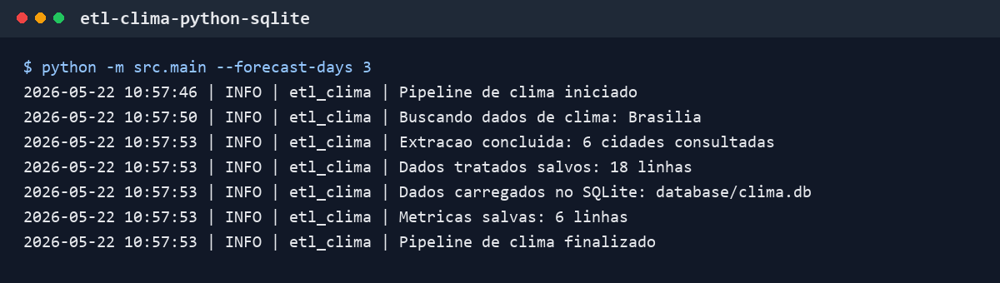

# etl-clima-python-sqlite

Projeto simples de ETL de clima usando a API pública da Open-Meteo, pandas e SQLite.

A ideia é buscar dados diários de algumas cidades, tratar o retorno da API e salvar uma base local para consultas simples.

```text
API Open-Meteo -> pandas -> SQLite -> métricas simples
```

O pipeline busca histórico recente dos últimos 7 dias e também mantém a previsão futura. A base final indica se cada linha é `historico` ou `previsao`.

## Objetivo Do Projeto

- consumir dados diários de clima pela API Open-Meteo;
- buscar histórico recente dos últimos 7 dias;
- manter previsão futura;
- transformar o JSON da API em tabela;
- salvar os dados tratados em CSV e SQLite;
- gerar métricas simples por cidade.

## Tecnologias Utilizadas

- Python
- pandas
- SQLite
- SQL
- Open-Meteo Forecast API
- logging

## Como Executar

Crie e ative um ambiente virtual:

```bash
python -m venv .venv
```

No Windows:

```powershell
.venv\Scripts\activate
```

Instale as dependências:

```bash
python -m pip install -r requirements.txt
```

Execute o pipeline:

```bash
python -m src.main
```

Também dá para ajustar a quantidade de dias de previsão ou histórico recente:

```bash
python -m src.main --forecast-days 3
python -m src.main --past-days 7
```

## Estrutura De Pastas

```text
etl-clima-python-sqlite/
|-- assets/
|   |-- screenshots/
|   |   |-- terminal-etl.png
|-- data/
|   |-- raw/
|   |-- processed/
|-- database/
|-- logs/
|-- sql/
|   |-- metricas_clima.sql
|-- src/
|   |-- __init__.py
|   |-- config.py
|   |-- extract.py
|   |-- load.py
|   |-- logger.py
|   |-- main.py
|   |-- metrics.py
|   |-- transform.py
|-- .gitignore
|-- README.md
|-- requirements.txt
```

Os arquivos de saída em `data/raw`, `data/processed`, `database` e `logs` são ignorados pelo Git.

## Fonte Dos Dados

Os dados vêm da API pública da Open-Meteo:

https://open-meteo.com/en/docs

Neste projeto, a Forecast API é usada com `past_days=7`, porque ela permite buscar histórico recente no mesmo endpoint de previsão. Para este escopo pequeno, isso é mais simples do que usar outro endpoint.

Cidades configuradas:

- São Paulo
- Rio de Janeiro
- Belo Horizonte
- Brasília
- Curitiba
- Recife

## Exemplo De Uso

O CSV tratado e a tabela `clima_diario` no SQLite têm colunas como:

```text
cidade
data
temperatura_media_c
temperatura_maxima_c
temperatura_minima_c
precipitacao_mm
tipo_dado
```

A coluna `tipo_dado` pode ter dois valores:

- `historico`: datas anteriores ao dia da coleta;
- `previsao`: o dia da coleta e os próximos dias.

Exemplo de consulta SQL:

```sql
SELECT
    cidade,
    tipo_dado,
    ROUND(AVG(temperatura_media_c), 2) AS temperatura_media_c,
    ROUND(SUM(precipitacao_mm), 2) AS precipitacao_total_mm
FROM clima_diario
GROUP BY cidade, tipo_dado
ORDER BY cidade, tipo_dado;
```

SQLite foi usado porque é simples, local e não exige configurar servidor. Para um projeto júnior de estudo, ele ajuda a praticar SQL sem aumentar demais a complexidade.

## Screenshot



## O Que Aprendi

- consumir dados de uma API pública;
- transformar JSON em tabela com pandas;
- organizar um pipeline em etapas de extração, transformação e carga;
- salvar dados em SQLite;
- escrever consultas SQL simples;
- gerar métricas por cidade;
- lidar com histórico recente e previsão na mesma base.

## Limitações

- usa poucas cidades;
- consulta apenas dados diários, sem granularidade por hora;
- depende da disponibilidade da API;
- os dados históricos são limitados ao escopo recente usado no projeto;
- as chamadas da API são feitas de forma sequencial;
- usa SQLite local;
- não possui agendamento automático;
- ainda não possui testes automatizados.

## Próximos Passos

- adicionar testes para as transformações principais;
- permitir configurar cidades por CSV;
- criar mais consultas SQL de análise;
- gerar relatórios simples em CSV;
- melhorar a integração com o dashboard.
